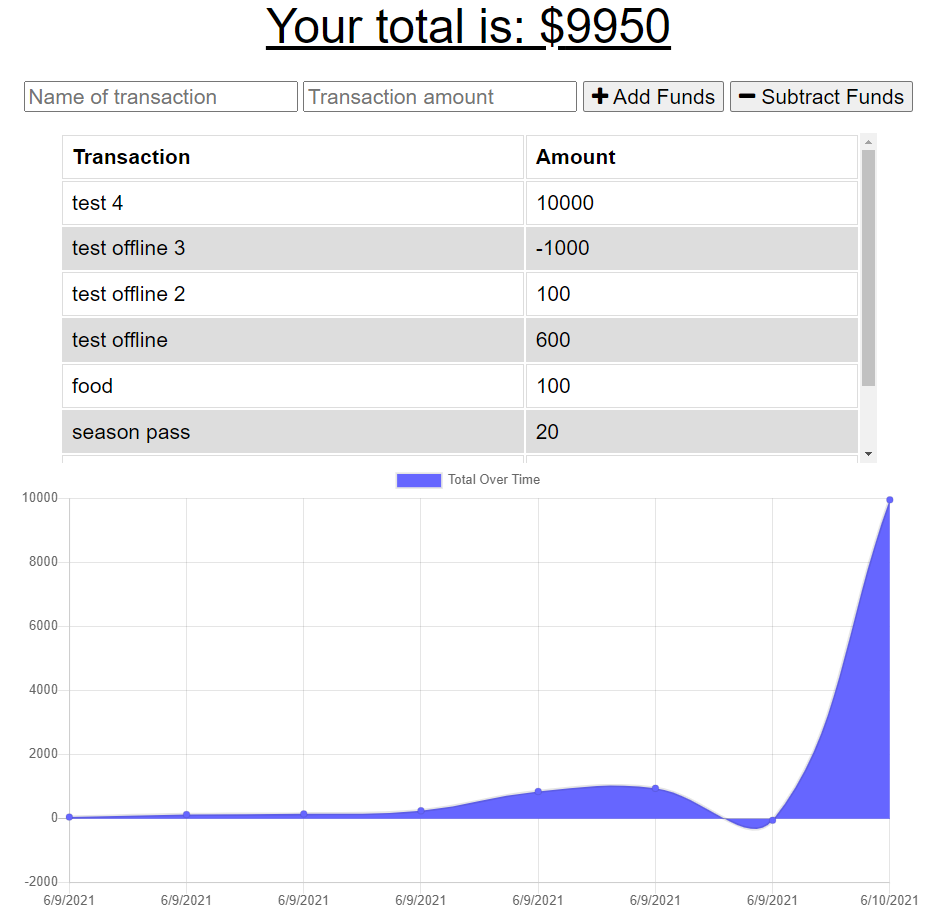

# Budget-Tracker-PWA

By daxburatto

## Description

Budget Tracker will help you add and subtract values from your budget to show how you spend.
[Heroku Deploy](https://budgettracker-pwa-w19.herokuapp.com/)

## Table of Contents

* [Installation](#installation)
* [License](#license)

## Installation

* Open Terminal
* Enter `npm init --y`
* Enter `npm start` to start the app locally

## License

[MIT](https://choosealicense.com/licenses/mit/)
